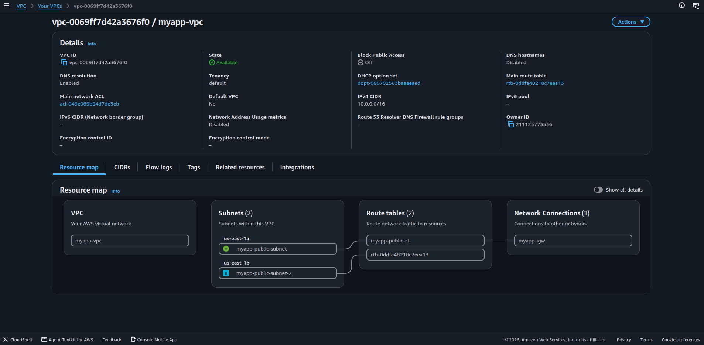
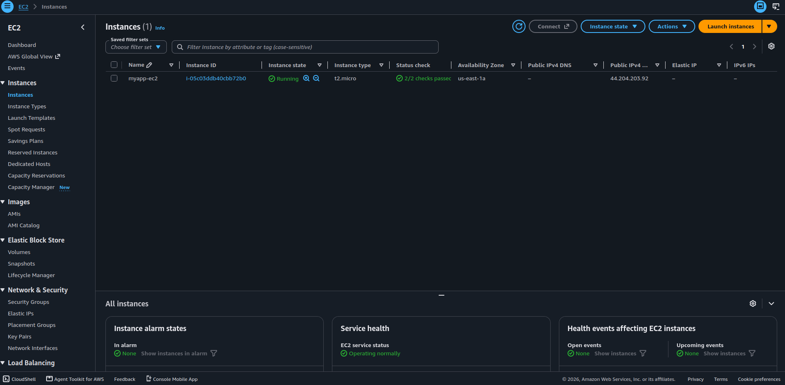
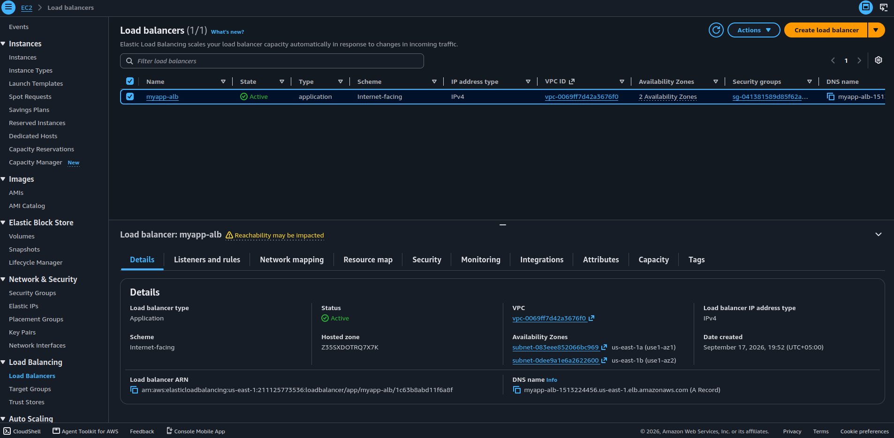
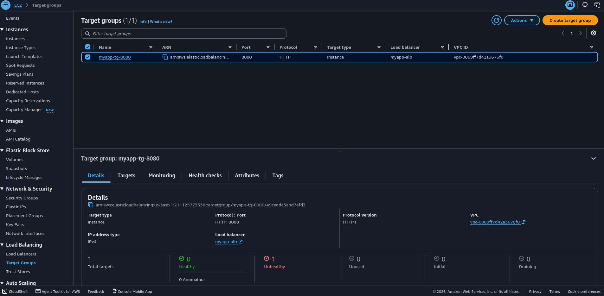
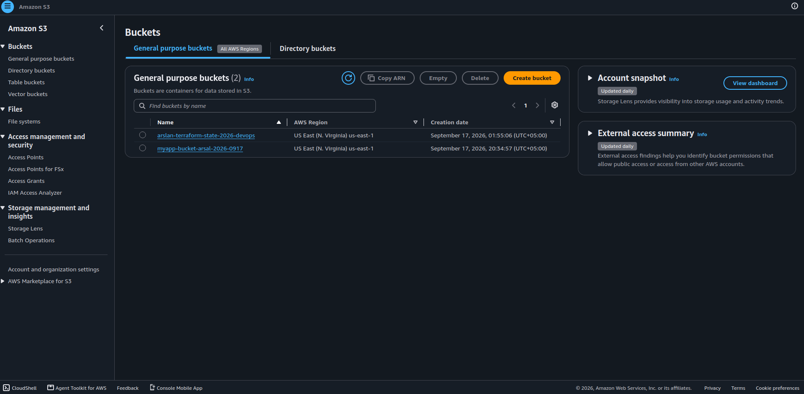
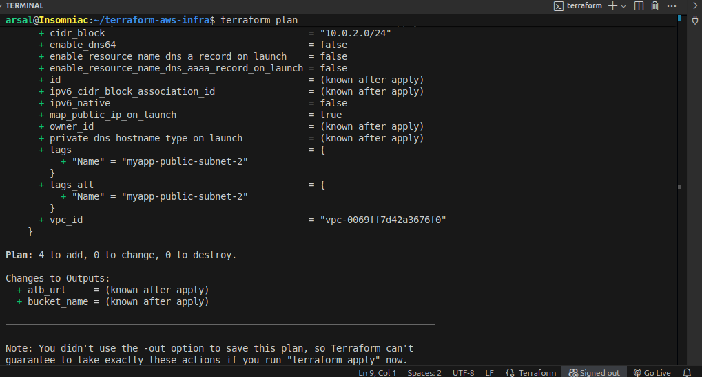

# 🚀 AWS Infrastructure with Terraform

A modular **AWS Infrastructure as Code (IaC)** project built with **Terraform**.
This project provisions a complete AWS environment including networking, compute, load balancing, and object storage using reusable Terraform modules.

---

# Architecture

                         Internet
                            |
                            v
                 +---------------------+
                 | Application Load    |
                 | Balancer (HTTP :80) |
                 +----------+----------+
                            |
                            v
                 +---------------------+
                 |    Target Group     |
                 |      HTTP :8080     |
                 +----------+----------+
                            |
                            v
                 +---------------------+
                 |    EC2 Instance     |
                 |      t2.micro       |
                 +---------------------+
                            |
              +-------------+-------------+
              |                           |
              v                           v
       Public Subnet 1              Public Subnet 2
        us-east-1a                   us-east-1b
              |                           |
              +-------------+-------------+
                            |
                            v
                     +-------------+
                     |     VPC     |
                     | 10.0.0.0/16 |
                     +-------------+
                            |
                            v
                    Internet Gateway


                 +----------------+
                 |   S3 Bucket    |
                 | Terraform Mgmt |
                 +----------------+
```

---

## ☁️ AWS Resources

This project provisions:

* **VPC**
* **2 Public Subnets**
* **Internet Gateway**
* **Route Table**
* **Route Table Association**
* **Security Group**
* **EC2 Instance**
* **Application Load Balancer**
* **ALB Target Group**
* **ALB Listener**
* **S3 Bucket**

---

## 🧩 Terraform Modules

The infrastructure is organized into reusable Terraform modules:

```text
terraform-aws-infra/
│
├── main.tf
├── provider.tf
├── backend.tf
├── variable.tf
├── outputs.tf
├── README.md
├── .gitignore
├── .terraform.lock.hcl
│
└── modules/
    ├── vpc/
    │   ├── main.tf
    │   ├── variables.tf
    │   └── outputs.tf
    │
    ├── ec2/
    │   ├── main.tf
    │   ├── variables.tf
    │   └── outputs.tf
    │
    ├── alb/
    │   ├── main.tf
    │   ├── variables.tf
    │   └── outputs.tf
    │
    └── s3/
        ├── main.tf
        ├── variables.tf
        └── outputs.tf
```

### VPC Module

Creates the networking infrastructure:

* VPC
* Public Subnet 1
* Public Subnet 2
* Internet Gateway
* Route Table
* Route Associations
* Security Group

### EC2 Module

Creates the application EC2 instance.

* Instance type: `t2.micro`
* Region: `us-east-1`

### ALB Module

Creates the load-balancing layer:

* Application Load Balancer
* Target Group
* Target Attachment
* HTTP Listener

Configuration:

* Listener: `HTTP :80`
* Target Group: `HTTP :8080`
* Health Check: `/login`

### S3 Module

Creates an S3 bucket managed through Terraform.

---

## 🌎 AWS Configuration

| Configuration       | Value         |
| ------------------- | ------------- |
| AWS Region          | `us-east-1`   |
| VPC CIDR            | `10.0.0.0/16` |
| Public Subnet 1     | `10.0.1.0/24` |
| Public Subnet 2     | `10.0.2.0/24` |
| Availability Zone 1 | `us-east-1a`  |
| Availability Zone 2 | `us-east-1b`  |
| EC2 Instance        | `t2.micro`    |
| ALB Listener        | HTTP :80      |
| Target Group        | HTTP :8080    |
| Health Check        | `/login`      |

---

## 🛠️ Technologies Used

* Terraform
* Amazon Web Services (AWS)
* AWS VPC
* AWS EC2
* AWS Application Load Balancer
* AWS S3
* Git
* GitHub
* Linux

---

## ⚙️ Terraform Workflow

### 1. Initialize

```bash
terraform init
```

### 2. Format

```bash
terraform fmt -recursive
```

### 3. Validate

```bash
terraform validate
```

### 4. Create Plan

```bash
terraform plan
```

### 5. Deploy

```bash
terraform apply
```

### 6. Destroy

```bash
terraform destroy
```

---

## ✅ Deployment

The infrastructure was successfully provisioned using Terraform.

Terraform deployment result:

```text
Apply complete!
Resources: 2 added, 1 changed, 1 destroyed.
```

The deployment successfully created the AWS networking, EC2, ALB, Target Group, and S3 infrastructure.

---

## 📸 Screenshots

### VPC & Networking


### EC2 Instance


### Application Load Balancer


### Target Group


### S3 Bucket


### Terraform Deployment


## ⚠️ ALB Health Check

The ALB target group was configured to forward traffic to port `8080`.

During testing, the EC2 target reported:

```text
Target.Timeout
```

Therefore, the Terraform infrastructure provisioning was successful, while the backend application did not pass the ALB health check during this deployment.

This project focuses primarily on **AWS infrastructure provisioning and Terraform automation**.

---

## 🔐 Security

Sensitive files are excluded through `.gitignore`.

The repository does not contain:

* AWS credentials
* Terraform state files
* `.pem` private keys
* `.tfvars` files
* `.terraform/` directory

---

## 💰 Cost Management

This project was created as a hands-on DevOps portfolio project.

After testing and taking screenshots, the AWS infrastructure can be removed with:

```bash
terraform destroy
```

This prevents unnecessary AWS resources from remaining active after the project is completed.

---

## 🎯 Learning Outcomes

Through this project, I practiced:

* Infrastructure as Code with Terraform
* Terraform modules
* Terraform variables and outputs
* AWS VPC networking
* Public subnet configuration
* Internet Gateway and routing
* Security Groups
* EC2 provisioning
* Application Load Balancer
* Target Groups
* Health checks
* S3 provisioning
* Terraform lifecycle management
* Git and GitHub workflow

---

## 👨‍💻 Author

**Muhammad Arslan**

Junior DevOps Engineer | Cloud & Automation Enthusiast

**GitHub:**
https://github.com/Arslan660

**LinkedIn:**
https://www.linkedin.com/in/muhammad-arslan-devops/

---

## 📌 Project Status

**Completed — AWS infrastructure provisioned and managed using Terraform.**

Built as a hands-on DevOps portfolio project focused on **AWS, Terraform, Infrastructure as Code, modular architecture, and cloud infrastructure automation.**
